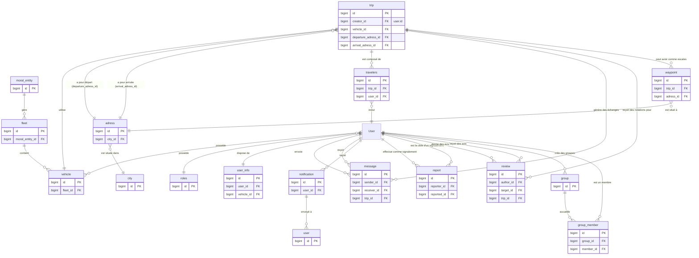

```mermaid 
erDiagram
    user {
        bigint id PK
    }
    user_info {
        bigint id PK
        bigint user_id FK
        bigint vehicle_id FK
  
    }

    roles {
        bigint id PK

    }

    moral_entity {
        bigint id PK
    }

    fleet {
        bigint id PK
        bigint moral_entity_id FK 
    }

    vehicle {
        bigint id PK
        bigint fleet_id FK 

    }

    city {
        bigint id PK

    }

    adress {
        bigint id PK
        bigint city_id FK
    }

    trip {
        bigint id PK
        bigint creator_id FK "user.id"
        bigint vehicle_id FK 
        bigint departure_adress_id FK 
        bigint arrival_adress_id FK 

    }

    travelers {
        bigint id PK
        bigint trip_id FK
        bigint user_id FK

    }

    message {
        bigint id PK
        bigint sender_id FK 
        bigint receiver_id FK 
        bigint trip_id FK 

    }

    notification {
        bigint id PK
        bigint user_id FK

    }

    report {
        bigint id PK
        bigint reporter_id FK 
        bigint reported_id FK 

    }

    review {
        bigint id PK
        bigint author_id FK 
        bigint target_id FK 
        bigint trip_id FK 

    }

    group {
        bigint id PK

    }

    group_member {
        bigint id PK
        bigint group_id FK 
        bigint member_id FK 
        
    }

    waypoint {
        bigint id PK
        bigint trip_id FK 
        bigint adress_id FK 
    }


    User ||--o{ vehicle : "possède"

    User }o--|| roles : "possède"
    
    moral_entity ||--o{ fleet : "gère"
    fleet ||--o{ vehicle : "contient"

    adress }o--|| city : "est située dans"

    trip ||--|| vehicle : "utilise"
    trip }o--|| adress : "a pour départ (departure_adress_id)"
    trip }o--|| adress : "a pour arrivée (arrival_adress_id)"
    
    trip ||--o{ travelers : "est composé de"
    travelers }o--|| User : "inclut"

    trip ||--o{ message : "génère des échanges"
    trip ||--o{ review : "reçoit des notations pour"
    trip ||--o{ waypoint : "peut avoir comme escales"
    waypoint }o--|| adress : "est situé à"

    User ||--|| user_info: "dispose de"
    User ||--o{ message : "envoie"
    User ||--o{ message : "reçoit"
    User ||--o{ notification : "reçoit"
    notification ||--o{ user : "envoyé à"

    User ||--o{ report : "effectue comme signalement"
    User ||--o{ report : "est la cible d'un signalement"

    User ||--o{ review : "donne des avis"
    User ||--o{ review : "reçoit des avis"

    User ||--o{ group : "crée des groupes"
    group ||--o{ group_member : "accueille"
    group_member }o--|| User : "est un membre"
``` 